# Customer-Resource-Management(CRM)

This is a simple app tried by me using spring boot, spring mvc ,jsp and spring rest services. This web app uses the best technology of html, css and bootstrap as the frontend and spring , hibernate and MYSQL 5 as the backend.

# CONFIGURING DATABASE

You can use any database and you can configure the authentication by editing the application.properties file present under resource directory. 

# IDE USED

For my convenient I  have used eclipse as the IDE , you can use any IDE for your convenient as it should support Spring-Boot and Maven on your local system

# Screen Shot

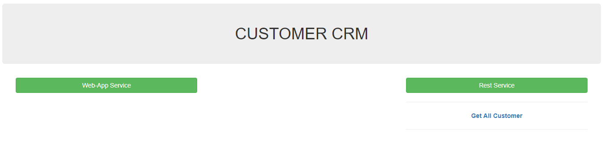
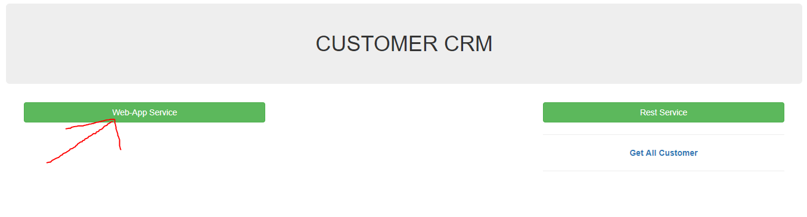
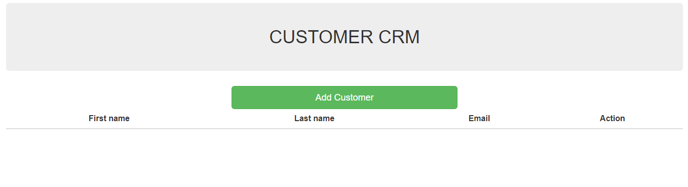
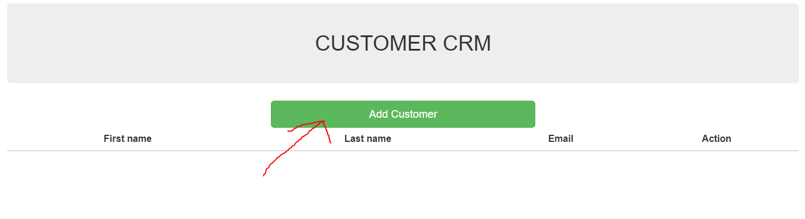
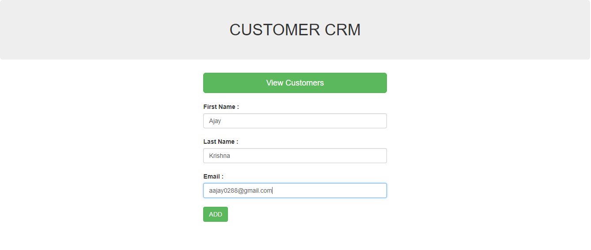
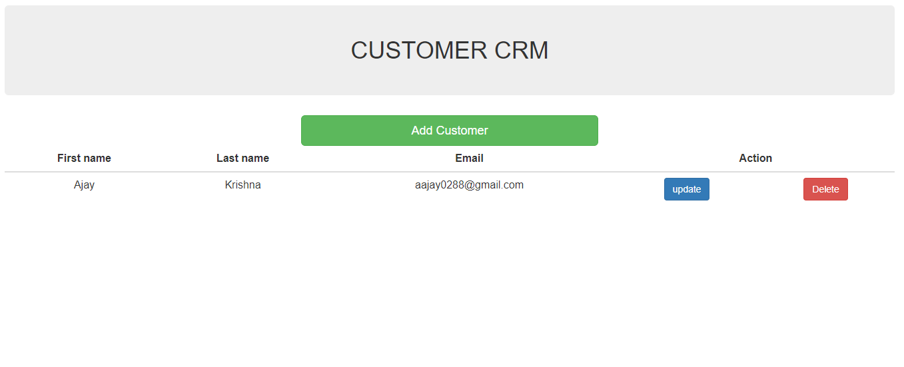
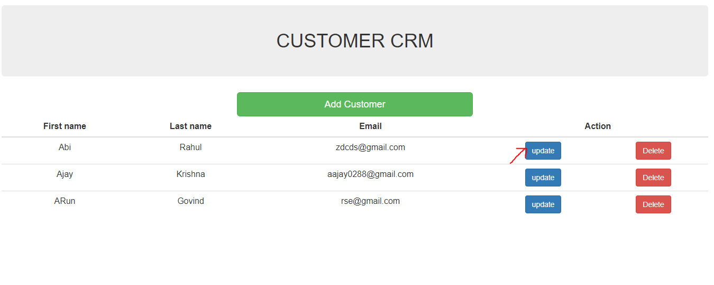
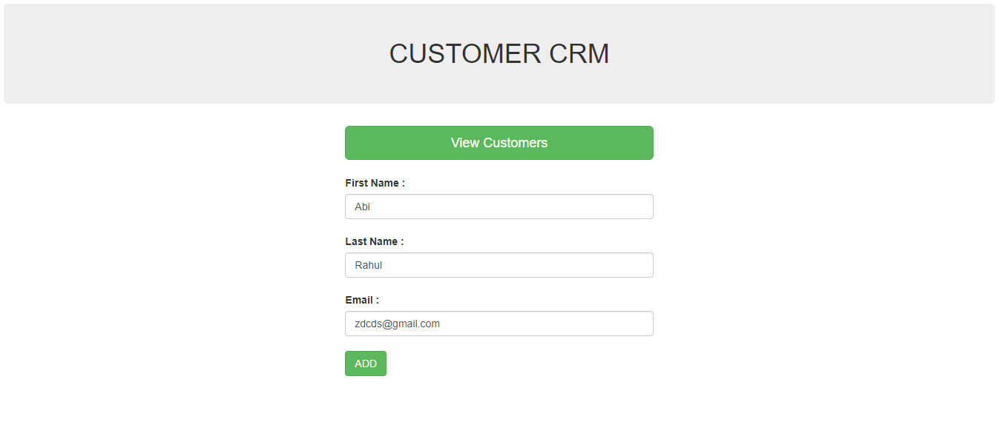
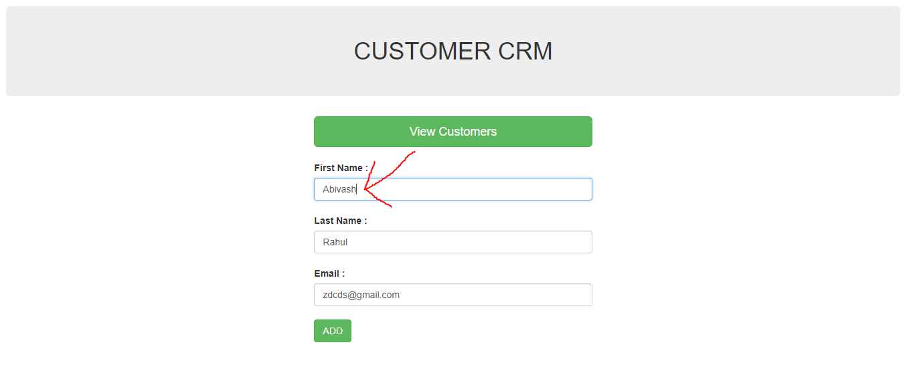
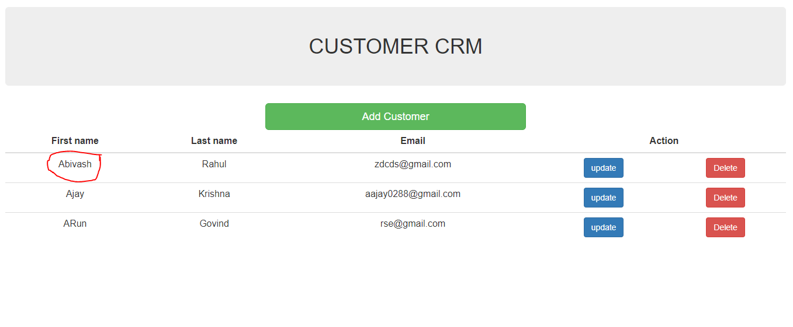
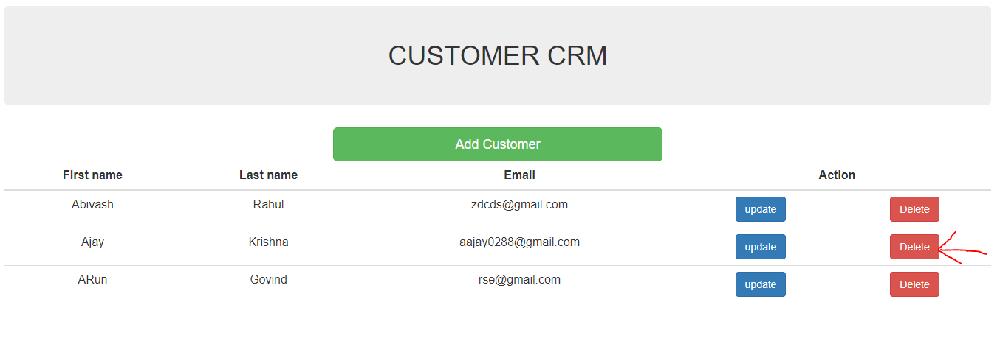
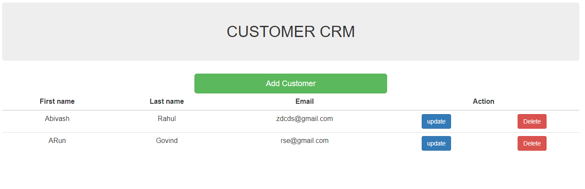

#Rest Web Services

REST stands for Representational State Transfer, which is an architectural style for networked hypermedia applications, it is primarily used to build Web services that are lightweight, maintainable, and scalable. A service based on REST is called a RESTful service.

Spring uses Thompson project for converting POJO to JSON and vice versa

#client tool -------> POSTMAN

The postman is used to use REST over HTTP

/api/customers ------------>(POST) Create a new customer

/api/customers ------------>(GET) Read a list of customers

/api/customers/{customerId} ----------->(GET) Read a single customer

/api/customers --------------> (PUT)Update an Existing customer

/api/customers/{customerId} -------------> (DELETE)Delete customer

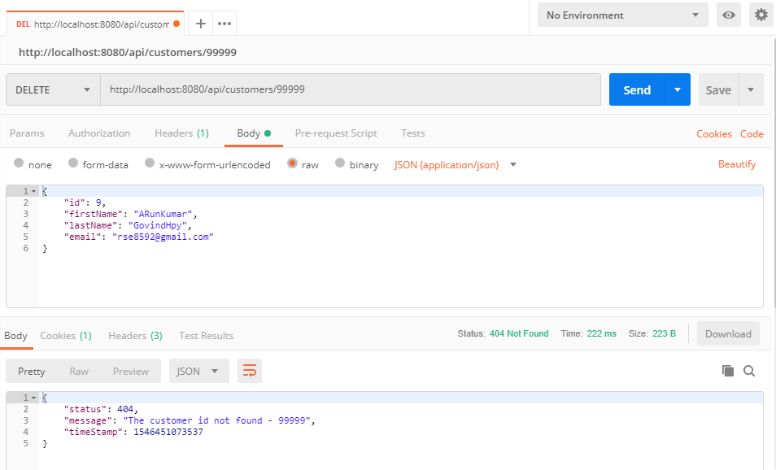

